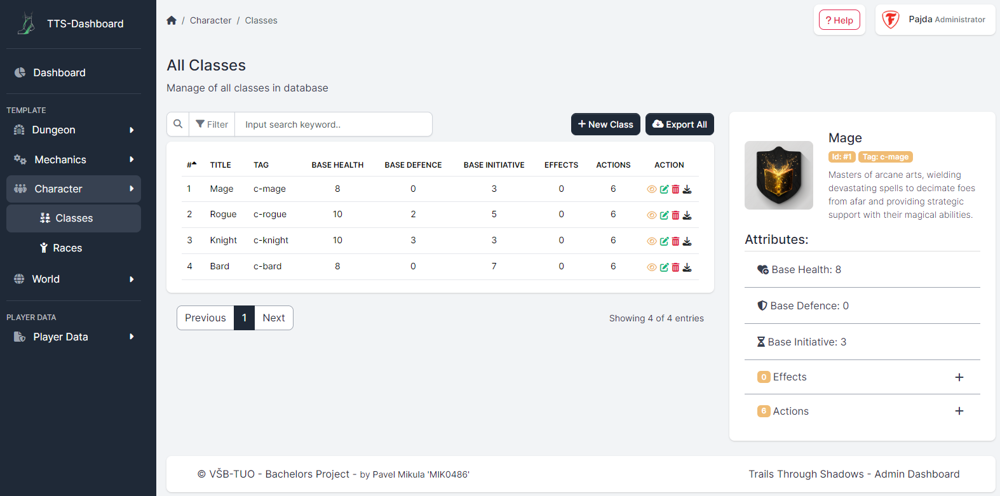
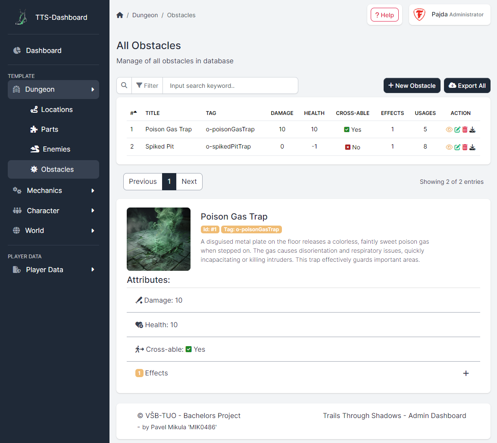
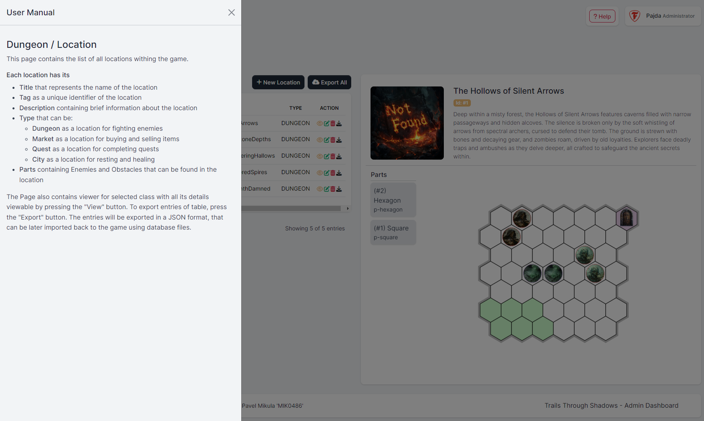
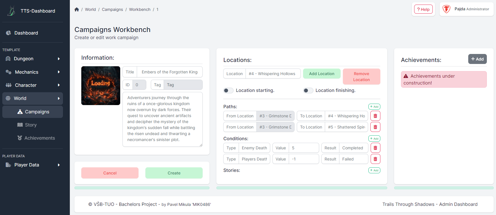
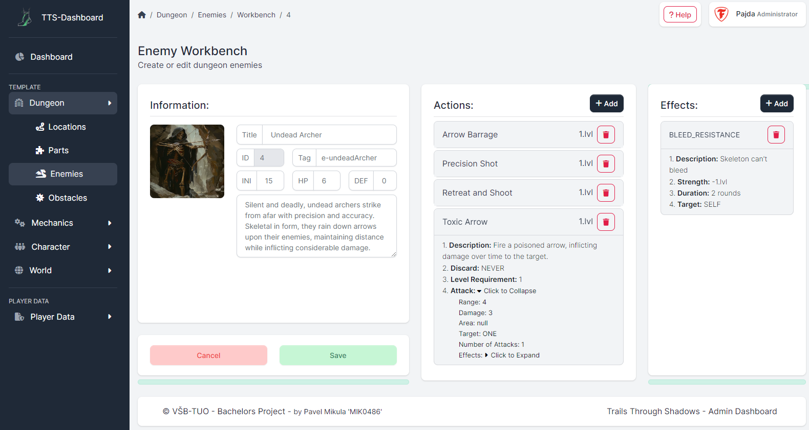
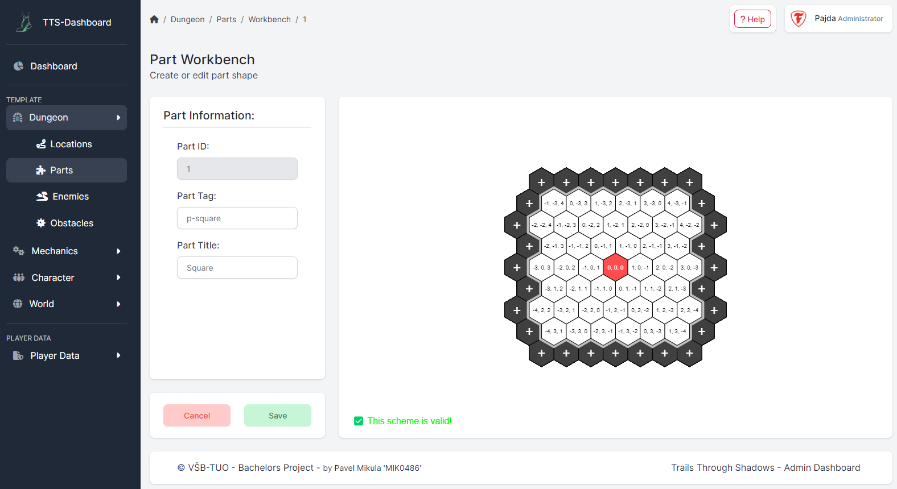

# TTS-Dashboard

This repository contains the code for the TTS Dashboard.  
The dashboard is a web application that allows users to view and interact with game data inside a TTS database using
API interface. It provides a user-friendly interface written in Django and TypeScript.

## Setup
- Clone the repository
  - `git clone https://github.com/Trails-Through-Shadows/TTS-Dashboard.git`
- Create a virtual environment
  - `python3 -m venv .venv`
  - `source .venv/bin/activate`
- Install the required packages
  - `pip install -r requirements.txt`
  - `npm install`
- Build all necessary files
  - `lessc static/less/style.less static/css/style.css`
  - `tsc -p tsconfig.json`
- Create .env file
  - `cp .env.example .env`
  - Update .env file with database credentials and other necessary information

## Running the server
- Activate the virtual environment
  - `source .venv/bin/activate`
- Migrate the database and create a superuser
  - **Note:** Migration and superuser creation are only necessary for the first time setup 
  - `python manage.py migrate`
  - `python manage.py createsuperuser`
- Run the server
  - `python manage.py runserver`

## Running the server in production
- Install gunicorn
  - `pip install gunicorn`
- Run the server using gunicorn
  - `python -m uvicorn dashboard.asgi:application`
- **Note:** Make sure to update the `ALLOWED_HOSTS` in `settings.py` to allow the domain name
- **Note:** Make sure to update the `DEBUG` in `settings.py` to `False` for production

## Accessing the dashboard
- Open a web browser and go to `http://localhost:8000/` to access the dashboard
- Use the superuser credentials to log in and access the dashboard

## Documentation
- [Dashboard Documentation](https://docs.tts-game.fun/dashboard)
- [API Documentation](https://api.tts-game.fun/docs)

## Screenshots

